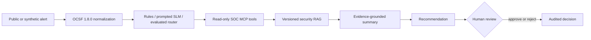

# MCP-Based SOC Copilot

An evaluation-led, private SOC triage prototype with public architecture and results documentation.

> RAG grounds changing security context. A small router handles structured triage. MCP exposes narrow, governed capabilities. Humans retain authority over sensitive decisions.

## V1 question

Can a bounded hybrid system improve alert triage while remaining measurable, reproducible, and safe?

V1 compares deterministic rules, prompted small language models, and—only if evidence supports it—an adapter/fine-tuned small model on the same synthetic evaluation set. Retrieval supplies versioned ATT&CK, detection, playbook, and synthetic organizational context. Recommendations never equal authorization.

## Current snapshot

Completed in the private implementation repository through Week 2:

- 8 supported alert scenarios
- 50 synthetic golden evaluation alerts
- OCSF 1.8.0 normalization with typed runtime validation
- 8 thin, typed, read-only FastMCP tool contracts
- implemented normalization, extraction, triage, policy, and retrieval services
- frozen 18-alert held-out comparison of rules and a prompted local 7B model
- 134 passing automated tests, repository-wide linting, and strict type checking across 44 source files

These figures describe private verification. The implementation, fixtures, prompts, per-alert reports, and detailed control logic are intentionally not published here.

## Week 2 result

For the frozen V1 scenarios, deterministic rules were both more accurate and much faster than the prompted model. Qwen 2.5 7B remained useful as a research candidate, but it did not earn authority over routing or ATT&CK mapping.

| Held-out measure | Rules | Prompted Qwen 2.5 7B |
| --- | ---: | ---: |
| Raw routing accuracy | **18/18 (100%)** | 14/18 (77.78%) |
| Governed routing accuracy | **18/18 (100%)** | 16/18 (88.89%) |
| Severity accuracy | **17/18 (94.44%)** | 13/18 (72.22%) |
| ATT&CK Top-3 recall | **9/9 (100%)** | 0/9 (0%) |
| Mean latency per alert | **0.05 ms** | 9.98 s |

These are directional prototype results from 18 synthetic held-out alerts. They are not production-performance claims. See [evaluation/week-02-baselines.md](evaluation/week-02-baselines.md) for the full aggregate report and limitations.

## Architecture

See [architecture/overview.md](architecture/overview.md) for boundaries, [architecture/week-02-current-state.md](architecture/week-02-current-state.md) for the implemented/target distinction, and [evaluation/methodology.md](evaluation/methodology.md) for the comparison plan.

## Explicit exclusions

- no real employer, customer, SIEM, or EDR data
- no live containment or autonomous remediation
- no production readiness or security-effectiveness claim
- no live threat-feed dependency in V1
- no claim of false-positive reduction without representative labels
- no public implementation, prompts, or complete evaluation set

## Repository map

- `architecture/` — system boundaries and data flow
- `contracts/` — sanitized, illustrative interfaces
- `datasets/` — selection rationale and provenance checklist
- `decisions/` — architecture decision records
- `evaluation/` — benchmark methodology and result template
- `threat-model/` — public, high-level risk summary
- `weekly-updates/` — evidence-backed sprint notes

## Week 3 decision

Run a bounded supervised LoRA/QLoRA experiment only after creating a separate training corpus and untouched challenge set. DPO is conditional on later preference-ranking errors; GRPO and production model routing remain out of scope for V1. Rules, safety policy, and authoritative ATT&CK mapping remain deterministic.
