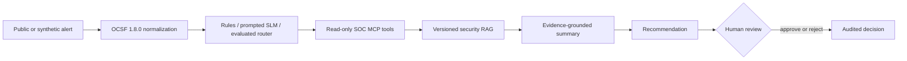

# MCP-Based SOC Copilot

An evaluation-led, private SOC triage prototype with public architecture and results documentation.

> RAG grounds changing security context. A small router handles structured triage. MCP exposes narrow, governed capabilities. Humans retain authority over sensitive decisions.

## V1 question

Can a bounded hybrid system improve alert triage while remaining measurable, reproducible, and safe?

V1 compares deterministic rules, prompted small language models, and—only if evidence supports it—an adapter/fine-tuned small model on the same synthetic evaluation set. Retrieval supplies versioned ATT&CK, detection, playbook, and synthetic organizational context. Recommendations never equal authorization.

## Week 1 snapshot

Completed in the private implementation repository:

- 8 supported alert scenarios
- 50 synthetic golden evaluation alerts
- OCSF 1.8.0 normalization with typed runtime validation
- 8 thin, typed, read-only FastMCP tool contracts
- security threat model and working vertical slice
- 60 passing automated tests

These figures describe private Week 1 verification. The fixtures and implementation are intentionally not published here.

## Architecture

See [architecture/overview.md](architecture/overview.md) for boundaries and [evaluation/methodology.md](evaluation/methodology.md) for the comparison plan.

## Explicit exclusions

- no real employer, customer, SIEM, or EDR data
- no live containment or autonomous remediation
- no production readiness or security-effectiveness claim
- no live threat-feed dependency in V1
- no claim of false-positive reduction without representative labels
- no public implementation, prompts, or complete evaluation set

## Repository map

- `architecture/` — system boundaries and data flow
- `contracts/` — sanitized, illustrative interfaces
- `datasets/` — selection rationale and provenance checklist
- `decisions/` — architecture decision records
- `evaluation/` — benchmark methodology and result template
- `threat-model/` — public, high-level risk summary
- `weekly-updates/` — evidence-backed sprint notes
