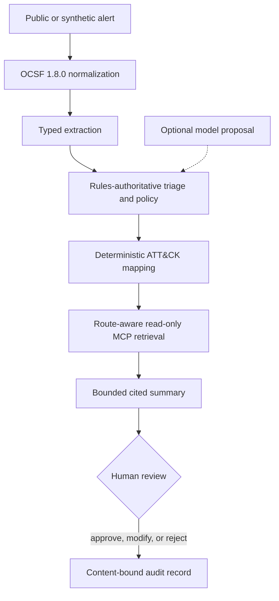

# MCP-Based SOC Copilot

An evaluation-led, private SOC triage prototype with public architecture and results documentation.

> Retrieval grounds changing security context. Models may propose structured triage. Deterministic controls retain routing authority, and humans retain authority over sensitive decisions.

## V1 question

Can a bounded hybrid system improve alert triage while remaining measurable, reproducible, and safe?

V1 compares deterministic rules, prompted small language models, and—only if evidence supports it—an adapter/fine-tuned small model on the same synthetic evaluation set. Retrieval supplies versioned ATT&CK, detection, playbook, and synthetic organizational context. Recommendations never equal authorization.

## Current snapshot

Completed in the private implementation repository through Week 4:

- 8 supported alert scenarios
- 50 synthetic golden evaluation alerts
- OCSF 1.8.0 normalization with typed runtime validation
- 8 thin, typed, read-only FastMCP tool contracts
- implemented normalization, extraction, triage, policy, and retrieval services
- frozen 18-alert held-out comparison of rules and a prompted local 7B model
- a separate 960-example synthetic SFT corpus with template-family-separated splits
- controlled LoRA and DoRA experiments on a local Qwen 2.5 3B model
- 96-case controlled challenge and 16-case independently authored robustness suite
- deterministic governance, evidence-reference validation, and fail-closed malformed-input handling
- integrated route-aware orchestration across eight read-only MCP capabilities
- bounded, provenance-bearing investigation summaries and analyst decision/audit binding
- frozen 200-alert independent comparison plus separate retrieval and boundary benchmarks

These figures describe private verification. The implementation, fixtures, prompts, per-alert reports, and detailed control logic are intentionally not published here.

## Week 2 result

For the frozen V1 scenarios, deterministic rules were both more accurate and much faster than the prompted model. Qwen 2.5 7B remained useful as a research candidate, but it did not earn authority over routing or ATT&CK mapping.

| Held-out measure | Rules | Prompted Qwen 2.5 7B |
| --- | ---: | ---: |
| Raw routing accuracy | **18/18 (100%)** | 14/18 (77.78%) |
| Governed routing accuracy | **18/18 (100%)** | 16/18 (88.89%) |
| Severity accuracy | **17/18 (94.44%)** | 13/18 (72.22%) |
| ATT&CK Top-3 recall | **9/9 (100%)** | 0/9 (0%) |
| Mean latency per alert | **0.05 ms** | 9.98 s |

These are directional prototype results from 18 synthetic held-out alerts. They are not production-performance claims. See [evaluation/week-02-baselines.md](evaluation/week-02-baselines.md) for the full aggregate report and limitations.

## Week 3 result

LoRA learned the bounded synthetic task, but independent evaluation prevented an overclaim. It achieved 100% raw routing on the 96-case controlled challenge and 87.5% on 16 independently authored cases. Deterministic governance contained both independent high-risk failures, but did not make the raw model correct.

DoRA matched LoRA's quality and repeated its failures while increasing local inference latency and peak memory. LoRA therefore earned only a conditional role as an untrusted proposal component. Production and autonomous routing remain a no-go.

See [evaluation/week-03-peft.md](evaluation/week-03-peft.md) for the aggregate comparison and [architecture/week-03-responsibility-boundary.md](architecture/week-03-responsibility-boundary.md) for ownership and release gates.

## Week 4 result

The larger independent evaluation changed the final architecture. On 200 independently authored synthetic alerts, deterministic rules achieved 93.5% routing accuracy with zero high-risk review misses. LoRA improved materially over the prompted model—81% routing, 81% severity, 68% ATT&CK candidate recall, and lower token output and latency—but missed its routing and schema gates and retained 15 governed high-risk review misses.

Typed retrieval achieved complete expected-record and provenance results on 16 supported questions, while 12 boundary cases verified empty, stale, conflicting, unsupported, and poisoned-content behavior. These closed-world results establish a bounded role for retrieval, not a general RAG-performance claim.

The sprint closes with a **controlled-prototype continue** and a **production/autonomous-routing no-go**. See [evaluation/week-04-system.md](evaluation/week-04-system.md), [architecture/week-04-final.md](architecture/week-04-final.md), and [weekly-updates/week-04.md](weekly-updates/week-04.md).

## Architecture

```mermaid
flowchart TD
    A[Public or synthetic alert] --> B[OCSF 1.8.0 normalization]
    B --> C[Typed extraction]
    C --> D[Rules-authoritative triage and policy]
    E[Optional model proposal] -.-> D
    D --> F[Deterministic ATT&CK mapping]
    F --> G[Route-aware read-only MCP retrieval]
    G --> H[Bounded cited summary]
    H --> I{Human review}
    I -->|approve, modify, or reject| J[Content-bound audit record]
```

See [architecture/overview.md](architecture/overview.md) for boundaries, [architecture/week-04-final.md](architecture/week-04-final.md) for the final implemented flow, and [evaluation/methodology.md](evaluation/methodology.md) for the comparison method.

## Explicit exclusions

- no real employer, customer, SIEM, or EDR data
- no live containment or autonomous remediation
- no production readiness or security-effectiveness claim
- no live threat-feed dependency in V1
- no claim of false-positive reduction without representative labels
- no public implementation, prompts, or complete evaluation set

## Repository map

- `architecture/` — system boundaries and data flow
- `contracts/` — sanitized, illustrative interfaces
- `datasets/` — selection rationale and provenance checklist
- `decisions/` — architecture decision records
- `evaluation/` — benchmark methodology and result template
- `threat-model/` — public, high-level risk summary
- `weekly-updates/` — evidence-backed sprint notes

## Final disposition

- Continue typed validation, rules-authoritative policy, pinned ATT&CK mapping, route-aware MCP retrieval, cited summaries, human decisions, and audit binding.
- Revise the LoRA proposal model; it receives no routing or authorization authority.
- Retain prompted inference only as a benchmark baseline.
- Do not claim production readiness, autonomous routing, or remediation capability.
