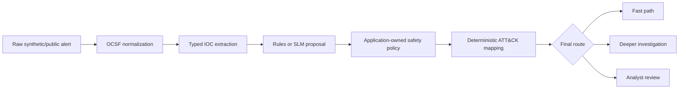

# Week 2 Current-State Architecture

Evaluation narrowed the model's responsibility. The implemented control path is:

## Implemented in the private prototype

- eight typed, read-only MCP capabilities
- deterministic normalization, extraction, baseline triage, policy enforcement, and ATT&CK mapping
- prompted-model adapter using the same typed contract and safety policy
- versioned local retrieval for threat, asset, incident, and playbook context
- three operational routes: `fast_path`, `deep_investigation`, and `analyst_review`

## Not yet implemented as an integrated flow

- automatic retrieval triggered by the governed route
- vector search or reranking
- evidence-grounded investigation synthesis
- fine-tuned router
- operational approval or remediation integration

Individual retrieval functions do not constitute a completed RAG workflow. This distinction prevents a target architecture diagram from being presented as current capability.

## Authority boundary

The model can propose a scenario, severity, disposition, route, and rationale. It cannot own safety invariants, authoritative ATT&CK mappings, approvals, or remediation. High-risk review requirements remain enforced by application code.
