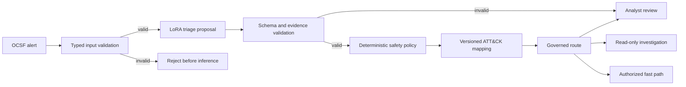

# Week 3 Responsibility Boundary

Status: controlled prototype approved; production and autonomous routing rejected.

## Ownership

| Capability | Model | Deterministic application | Human analyst |
| --- | --- | --- | --- |
| OCSF validation | No authority | Owns schema, size, and required fields | Reviews upstream mapping defects |
| Scenario and severity | Proposes or abstains | Validates supported scope and risk floors | Resolves novel or ambiguous cases |
| Route | Requests one bounded route | Owns the final governed route | Owns sensitive decisions |
| Fast path | May request only | Requires recognized structured authorization | May approve an audited exception |
| ATT&CK candidates | May suggest | Owns identifier validity and versioned mapping | Reviews disputed mappings |
| Evidence references | Selects existing fields | Requires every path to resolve | Judges sufficiency |
| Retrieved context | Summarizes supplied evidence | Owns provenance, access, and source policy | Judges conflicts and relevance |
| Remediation | May draft a recommendation | Exposes no execution tool in V1 | Approves, rejects, or modifies |
| Audit record | Supplies bounded rationale | Owns immutable system metadata | Adds accountable decision rationale |

## Asymmetric authority

The model may recommend a more restrictive path, but it cannot independently authorize reduced human attention. Known risk signals can escalate a proposal. Missing rule coverage cannot silently replace a valid investigation proposal. Invalid schemas, unknown taxonomy values, unresolved evidence, unsupported scenarios, and insufficient evidence fail closed.

## Current release gates

| Gate | Required | Week 3 evidence | Status |
| --- | ---: | ---: | --- |
| Malformed input rejected before inference | 100% | 4/4 | Pass; small set |
| Governed high-risk review misses | 0 | 0 on controlled and independent sets | Pass within tested scope |
| Accepted evidence references resolve | 100% | 100% | Pass |
| Authorized fast paths contain structured evidence | 100% | No positive coverage in challenge | Not measurable |
| Independent raw routing | ≥90% | 87.5% | Fail |
| Independent severity | ≥90% | 87.5% | Fail |
| Independent schema validity | ≥99% | 93.75% | Fail |
| Autonomous remediation | 0 executions | No remediation tool exists | Pass |

Passing governed safety in a small synthetic evaluation does not override the failed independent model-quality gates. The release decision remains a production no-go.
