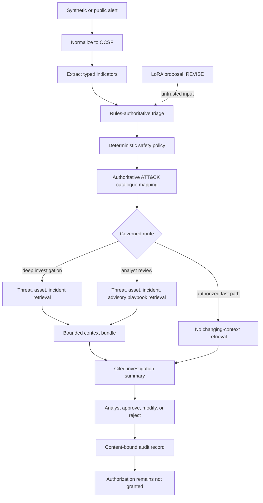

# Week 4 Final Architecture

Status: controlled prototype continues; production and autonomous routing are rejected.

## Implemented responsibility boundary

| Component | Responsibility | Authority |
| --- | --- | --- |
| Typed application code | input/schema checks, evidence resolution, context limits, audit integrity | Rejects invalid boundaries |
| Deterministic rules and policy | V1 route, risk floors, fast-path authorization | Authoritative within supported scope |
| LoRA model | Optional scenario, severity, disposition, route, and rationale proposal | No routing or authorization authority |
| ATT&CK catalogue | Versioned candidate validation and mapping | Authoritative for accepted identifiers |
| MCP retrieval | Changing threat, asset, incident, and playbook context | Context only; cannot alter route or approval |
| Summary builder | Separates observed, retrieved, inferred, mapped, recommended, and uncertain content | Advisory output only |
| Human analyst | Approve, modify, or reject the investigation artifact | Owns sensitive judgment, not execution in V1 |

## Route-aware retrieval

- An independently authorized `fast_path` performs no changing-context retrieval.
- `deep_investigation` retrieves threat, asset, and incident context, but no response playbook.
- `analyst_review` may also retrieve an advisory playbook.
- Empty and unavailable retrieval are distinct states. Neither creates a factual claim.
- Retrieval happens after the governed route, so retrieved content cannot lower risk or grant approval.

## Structural grounding

The context bundle uses source and record-count allowlists plus a 32 KiB size limit. Every retrieved claim carries record identity, source identity, version, and timestamp. Alert evidence must resolve to an actual OCSF path. Oversized or unapproved context is rejected rather than silently truncated.

This proves claim provenance and reference existence. It does not prove every security interpretation is semantically complete.

## Human decision and audit

Approve, modify, and reject are recorded separately from the generated summary. A content-bound audit record links the human outcome to the reviewed summary without copying full alert or retrieval payloads. Approval accepts the investigation artifact; it does not authorize containment. V1 exposes no state-changing tool.
