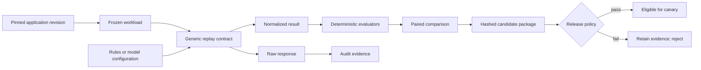

# LLM Release Engineering Lab

An evaluation-led lab for turning model, prompt, and policy changes into reproducible, governable release candidates.

> Packaging records what was tested. Deterministic policy decides whether the candidate may progress. A package is not an approval.

## Project question

What evidence, integrity controls, and release gates should an AI change satisfy before it enters progressive delivery?

The first workload reuses the synthetic [MCP-Based SOC Copilot](../01-mcp-soc-copilot/README.md) task, but the release engine remains independent of SOC-specific types and rules. Week 1 froze, replayed, evaluated, compared, and packaged an offline candidate. Week 2 connected that evidence to CI policy, GitOps promotion, staged analysis, and rollback in a local Kubernetes lab.

## Week 1 result

One 50-case synthetic workload was replayed against deterministic rules, prompted Qwen 2.5 3B, and a Qwen 2.5 3B LoRA candidate.

| Configuration | Schema validity | Routing accuracy | High-risk fast-path misses |
| --- | ---: | ---: | ---: |
| Deterministic rules | **50/50 (100%)** | **49/50 (98%)** | **0/7** |
| Prompted Qwen 2.5 3B | 26/50 (52%) | 26/50 (52%) | **0/7** |
| Qwen 2.5 3B LoRA | 47/50 (94%) | 39/50 (78%) | **1/7** |

The LoRA candidate improved on the prompted model, but it violated the predeclared zero-miss safety gate. The release decision was **reject from canary**. Deterministic rules remain the rollback baseline.

These are single-run results on a frozen synthetic workload, not production SOC-effectiveness claims. See [evaluation/week-01-results.md](evaluation/week-01-results.md) for denominators and limitations.

## Week 2 result

An eight-scenario challenge compared deterministic rules with untuned Qwen 2.5 3B under a frozen release policy. The prompted candidate achieved 62.5% schema validity, 62.5% routing accuracy, 37.5% severity accuracy, and 25% ATT&CK Top-3 recall; rules achieved 100% on those challenge measures. The candidate also lacked the policy's required 50 cases and three repeated runs. It failed offline and never entered canary.

A separate generic synthetic service then exercised the delivery controls. A known-good revision passed the logical 5% and 25% analysis stages and reached 100%. A controlled regression failed at the first stage, was scaled to zero, and left the prior healthy ReplicaSet serving. This validates the lab's control path, not the rejected SOC model or a production deployment.

See [evaluation/week-02-system.md](evaluation/week-02-system.md) for results and limitations.

## Week 1 architecture

See [architecture/overview.md](architecture/overview.md) for component and trust boundaries.

## Public artifacts

- [Week 1 update](weekly-updates/week-01.md)
- [Week 2 update](weekly-updates/week-02.md)
- [Architecture overview](architecture/overview.md)
- [Week 2 progressive-delivery architecture](architecture/week-02-progressive-delivery.md)
- [Workload card](datasets/soc-copilot-workload-v1.md)
- [Metric definitions](evaluation/metrics.md)
- [Week 1 results](evaluation/week-01-results.md)
- [Week 2 results](evaluation/week-02-system.md)
- [Release-policy rationale](evaluation/release-policy.md)
- [Statistical assumptions](evaluation/statistical-assumptions.md)
- [Release-candidate identity decision](decisions/0001-versioned-release-candidate.md)
- [Deterministic-gates decision](decisions/0002-deterministic-gates.md)
- [Canary-authorization decision](decisions/0003-offline-pass-authorizes-canary-only.md)
- [Delivery-control ownership decision](decisions/0004-separate-gitops-and-rollout-control.md)
- [Public threat-model summary](threat-model/public-summary.md)

## Explicit exclusions

- no complete evaluation set, expected labels, prompts, or per-case outputs
- no model weights, adapters, runtime configuration, or private implementation
- no production traffic, customer data, credentials, or private infrastructure identifiers
- no production-readiness or security-effectiveness claim
- no claim that the synthetic rollout demonstrates SOC-model safety
- no exact traffic-percentage claim for the two-replica local rollout
- no production telemetry, production traffic, or production rollback evidence
- no release authority assigned to an uncalibrated model judge
