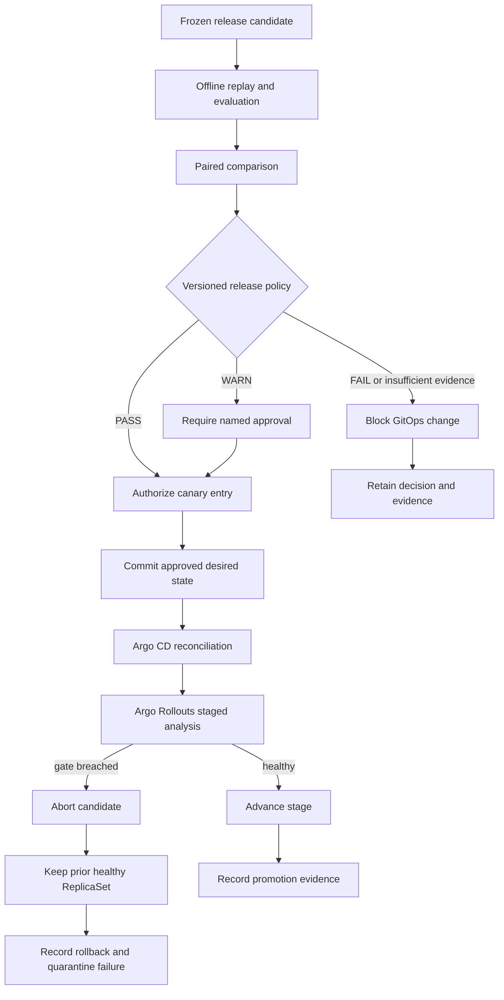

# Week 2 Progressive-Delivery Architecture

## Control flow

## Ownership boundaries

| Component | Owns | Does not own |
| --- | --- | --- |
| Release policy | Offline eligibility and evidence sufficiency | Cluster reconciliation or traffic shifting |
| Guarded GitOps updater | Whether approved evidence may change desired state | Re-evaluating model quality |
| Argo CD | Reconciliation of the approved Git revision | Canary analysis or release-policy interpretation |
| Argo Rollouts | Stage progression, analysis, abort, and stable ReplicaSet retention | Offline model approval |
| Analysis provider | Observable rollout signals | Candidate identity or policy revision |
| Failure quarantine | Preservation for review | Automatic relabeling or training-set admission |

## Local-lab interpretation

The configured 5%, 25%, and 100% values are logical stages. With two replicas and no ingress or service-mesh traffic router, they do not represent exact request weights. Synthetic Prometheus-compatible metrics make healthy and regressed states reproducible, but do not establish production observability.

## Fail-closed behavior

A missing metric, insufficient sample, breached hard gate, mismatched candidate identity, or failed artifact verification cannot silently become approval. Offline permission ends at canary entry; continued promotion depends on fresh rollout evidence at each stage.
